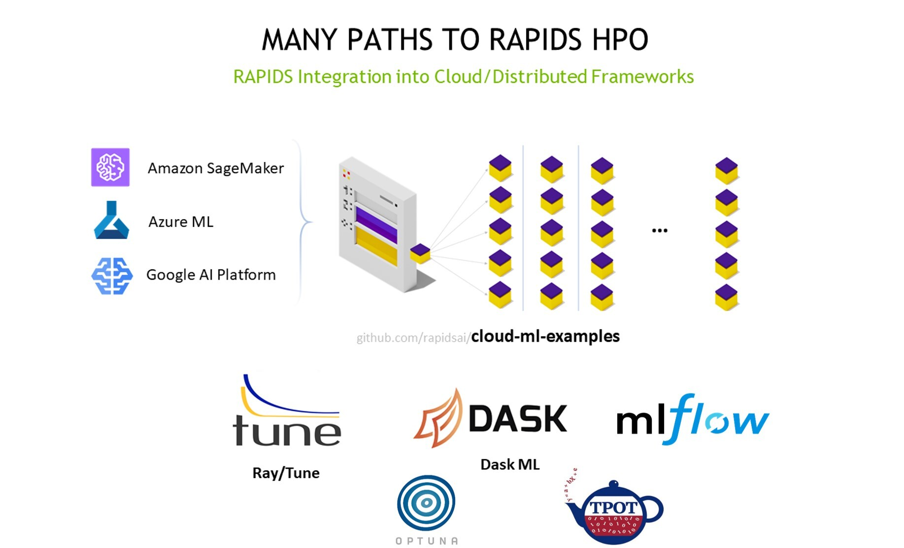

# <div align="left">&nbsp;RAPIDS Cloud Machine Learning Services Integration</div>

RAPIDS is a suite of open-source libraries that bring GPU acceleration
to data science pipelines. Users building cloud-based hyperparameter
optimization experiments can take advantage of this acceleration
throughout their workloads to build models faster, cheaper, and more
easily on the cloud platform of their choice.

This repository provides example notebooks and "getting started" code
samples to help you integrate RAPIDS with the hyperparameter
optimization services from Azure ML, AWS Sagemaker, Google
Cloud, and Databricks. The directory for each cloud contains a step-by-step guide to
launch an example hyperparameter optimization job. Each example job will use RAPIDS
[cuDF](https://github.com/rapidsai/cudf) to load and preprocess 
data and use [cuML](https://github.com/rapidsai/cuml) or [XGBoost](https://github.com/dmlc/xgboost) for GPU-accelerated model training. RAPIDS also integrates easily with MLflow to track and orchestrate experiments from any of these frameworks. 

For large datasets, we have added example notebooks to load data and train models on multiple GPUs in the same instance or in a multi-node multi-GPU cluster using [Dask](https://github.com/dask/dask). 

| | | |
| - | - | - |
| **Microsoft Azure** | [Azure ML HPO](https://github.com/rapidsai/cloud-ml-examples/blob/main/azure/README.md "Azure Deployment Guide") | [Azure multi-node multi-GPU cuML](https://github.com/rapidsai/cloud-ml-examples/tree/main/azure#2-rapids-mnmg-example-using-dask-cloud-provider "Azure MNMG notebook") 
| **Amazon Web Services (AWS)** | [AWS SageMaker HPO](https://github.com/rapidsai/cloud-ml-examples/blob/main/aws/README.md "SageMaker Deployment Guide") |
| **Google Cloud Platform (GCP)** | [Google AI Platform HPO ](https://github.com/rapidsai/cloud-ml-examples/blob/main/gcp/README.md "GCP Deployment Guide") | [Google Kubernetes Engine (GKE) multi-node multi-GPU XGBoost and cuML](WIP "GKE MNMG notebook") 
| **Databricks** | [Hyperopt and MLflow on Databricks ](https://github.com/rapidsai/cloud-ml-examples/blob/main/databricks/README.md "Databricks Cloud Deployment Guide") |
| **MLflow** | [Hyperopt and MLflow on GKE](https://github.com/rapidsai/cloud-ml-examples/blob/main/mlflow_project/docker_environment/README.md "Kubernetes MLflow Deployment with RAPIDS")
| **Optuna** | [Dask-Optuna HPO](https://github.com/rapidsai/cloud-ml-examples/blob/main/optuna/notebooks/optuna_rapids.ipynb "Dask-Optuna notebook") | [Optuna on Azure ML](https://github.com/rapidsai/cloud-ml-examples/blob/main/optuna/notebooks/azure-optuna/run_optuna.ipynb "Optuna on Azure notebook")
| **Ray Tune** | [Ray Tune HPO](https://github.com/rapidsai/cloud-ml-examples/tree/main/ray "RayTune Deployment Guide")
---

## Quick Start Using RAPIDS Cloud ML Container

### Pull Docker Image:
```shell script
docker pull rapidsai/rapidsai-cloud-ml:0.17-cuda11.0-base-ubuntu18.04-py3.8
```
### Build Docker Image:
From the root cloud-ml-examples directory:
```shell script
docker build --tag rapidsai-cloud-ml:latest --file ./common/docker/Dockerfile.training.unified ./
```

## Bring Your Own Cloud (Dask and Ray)

In addition to public cloud HPO options, the respository also includes
"BYOC" sample notebooks that can be run on the public cloud or private
infrastructure of your choice, these leverage [Ray Tune](https://docs.ray.io/en/master/tune/index.html) or [Dask-ML](https://ml.dask.org/) for distributed infrastructure.

Check out the [RAPIDS HPO](https://rapids.ai/hpo.html) webpage for video tutorials and blog posts.


