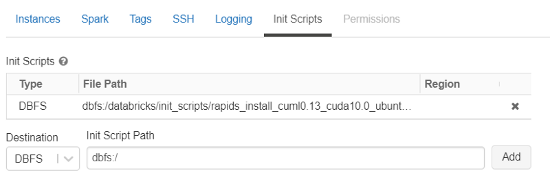

# Databricks Notebooks with MLFlow, RAPIDS, and Hyperopt

This directory contains a sample notebook that walks through the
optimization of a random forest model using cuML and hyperopt on the
DataBricks cloud. It also includes init scripts to install RAPIDS
automatically on your DataBricks cluster.

It has been tested with RAPIDS 0.13 on DataBricks ML Runtime 6.6. (Support for RAPIDS 0.14 is planned for the near future.)

# Running the demo on DataBricks

## Upload RAPIDS 0.13 Init Script to DBFS
* Copy `src/rapids_install_cuml0.13_cuda10.0_ubuntu16.04.sh` onto your Databricks dbfs file system.
    * This will become the base init script that is run at cluster start up.
    * Example:
    ```shell script
    $ dbfs configure
       ... configure your dbfs client for your account ...
    $ dbfs cp src/rapids_install_cuml0.13_cuda10.0_ubuntu16.04.sh dbfs:/databricks/init_scripts/
    ```
   
## Create and Configure a Cluster
* Create your cluster:
    1. Select a GPU enabled Databricks runtime. Ex: 6.6 ML 
        * Currently 'Use your own Docker container' is not available for ML instances.
    2. Select a GPU enabled worker and driver type
        * **Note** Selected GPU must be Pascal generation or greater. p2.X is not supported.
        * Recommended: `g4dn.xxxx` (NVIDIA T4) or `p3.xxxx` (NVIDIA V100) for AWS users
    3. Select `Advanced` -> `init_scripts`
        * Add an init scripts with the location `dbfs:/databricks/init_scripts/rapids_install_cuml0.13_cuda10.0_ubuntu16.04.sh'
* Launch your cluster
  * At this point, you should have RAPIDS 0.13 installed in the databricks-ml-gpu conda environment, and can import cudf/cuml modules.



## Launching the notebook

1. Upload the `rapids_airline_hyperopt.ipynb` notebook to your workspace.
2. Uncomment the "data download" cell and configure it to point to a path of your choice for data download. By default, it will use a smaller (200k row) dataset. This executes fast but doesn't demonstrate the full speedups possible with larger datasets.
3. Execute all of the cells to launch your hyperopt job.
4. Optionally, check out stats in the runs page and Experiment UI.


## More on Integrating Databricks Jobs with MLFlow and RAPIDS

You can find more detail in [this blog post on MLFlow + RAPIDS](https://medium.com/rapids-ai/managing-and-deploying-high-performance-machine-learning-models-on-gpus-with-rapids-and-mlflow-753b6fcaf75a).

### MLFlow and RAPIDS
1. RAPIDS Attempts to maintain compatibility with the SKlearn API. This means that, in general, you will be able to
utilize cuML models with the MLFlow Sklearn interface, including model training, saving artifacts/models, and deploying
saved models.
    1. Ex. 
    ```python
   import mlflow
   from cuml.ensemble import RandomForestClassifier
   
   model = RandomForestClassifier()
   mlflow.sklearn.log_model(model, "cuml_model", conda_env='conda.yaml')
    ```
