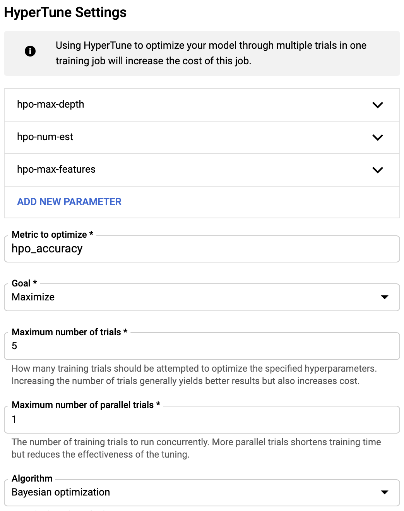
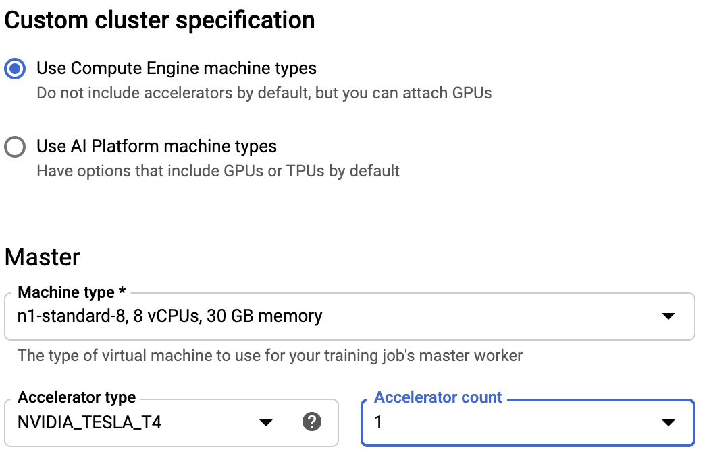

## Quick start guide
Here we will go over some common tasks, related to utilizing RAPIDS on the GCP AI Platform. Note that strings containing '[YOUR_XXX]' indicate items that you will need to supply, based on your specific resource names and environment.

### Create a Notebook using the RAPIDS environemnt
Motivation: We would like to create a GCP notebook with RAPIDS 0.18 release
Workflow: We will create a notebook instance using the `RAPIDS 0.18 [Experimental]` env

1. Log into your GCP console.
    1. Select AI-Platform -> Notebooks
    1. Select a "New Instance" -> "RAPIDS 0.18 [Experimental]"
        1. Select 'Install NVIDIA GPU driver automatically for me'
        1. Create
        1. Once JupterLab is running, you will have jupyter notebooks with rapids installed and rapids notebook examples under tutorials/RapidsAi.

To create an instance with A100s:
1. Select "New Instance" -> "Customize instance"
1. Select us-central1 region 
1. Select "RAPIDS 0.18 [Experimental]" Environment
1. Choose A2 highgpu (for 1, 2 4 and 8 A100s) or A1 megagpu (16x A100s) as machine type

### Install RAPIDS on a pre-made Notebook
Motivation: We have an existing GCP notebook that we wish to update to support RAPIDS functionality.  
Workflow: We will create a notebook instance, and run a shell script that will install a Jupyter kernel and allow us to run RAPIDS based tasks.  
  
1. Log into your GCP console.
    1. Select AI-Platform -> Notebooks
    1. Select a "New Instance" -> "Python 3 (CUDA Toolkit 11.0)" -> With 1 NVIDIA Tesla T4
        1. Select 'Install NVIDIA GPU driver automatically for me'
        1. Create.
    1. Once JupyterLab is running
        1. Open a new terminal
        1. Run
           ```shell
           RAPIDS_VER=21.06
           CUDA_VER=11.0
           wget -q https://rapidsai-data.s3.us-east-2.amazonaws.com/conda-pack/rapidsai/rapids${RAPIDS_VER}_cuda${CUDA_VER}_py3.8.tar.gz
           tar -xzf rapids${RAPIDS_VER}_cuda${CUDA_VER}_py3.8.tar.gz -C /opt/conda/envs/rapids_py38
           conda activate rapids_py38
           conda unpack
           ipython kernel install --user --name=rapids_py38
           ```
        1. Once completed, you will now have a new kernel in your jupyter notebooks called 'rapids_py38' which will have rapids installed.

### Deploy a custom RAPIDS training container utilizing the 'airline dataset', and initiate a training job with support for HyperParameter Optimization (HPO)
Motivation: We would like to be able to utilize GCP's AI Platform for training a custom model, utilizing RAPIDS.  
Workflow: Install the required libraries, and authentication components for GCP, configure a storage bucket for persistent data, build our custom training container, upload the container, and launch a training job with HPO.

1. Install GCP 'gcloud' SDK
    1. See: https://cloud.google.com/sdk/install
1. Configure gcloud authorization for docker on your build machine
    1. See: https://cloud.google.com/container-registry/docs/advanced-authentication
1. Configure a google cloud object storage bucket that will provide and output location 
1. Pull or build training containers and upload to GCR
   1. Pull
        1.  Find the appropriate container: [Here](https://hub.docker.com/r/rapidsai/rapidsai-cloud-ml/tags?page=0&ordering=last_updated)
        1. `docker tag <image> gcr.io/[YOUR_PROJECT_NAME]/rapids_training_container:latest`
   1. Build
        1. `$ cd .`
        1. `$ docker build --tag gcr.io/[YOUR_PROJECT_NAME]/rapids_training_container:latest --file common/docker/Dockerfile.training.unified .`
        1. `$ docker push gcr.io/[YOUR_PROJECT_NAME]/rapids_training_container:latest`
1. Training via GCP UI
    1. A quick note regarding GCP's cloudml-Hypertune
        1. This library interacts with the GCP AI Platform's HPO process by reporting required optimization metrics to the system after each training iteration.
        ```python
            hpt.report_hyperparameter_tuning_metric(
            hyperparameter_metric_tag='hpo_accuracy',
            metric_value=accuracy)
        ```
        1. For our purposes, the 'hyperparameter_metric_tag' should always correspond to the 'Metric to optimize' element passed to a job deployment.
    1. Training Algorithm
        1. From the GCP console select 'jobs' -> 'new training job' -> custom code training
        1. Choose 'Select a container image from the container Registry'
        1. Set 'Master image' to 'gcr.io/[YOUR_PROJECT_NAME]/rapids_training_container:latest'
        1. Set 'Job directory' to 'gs://[YOUR_GOOGLE_STORAGE_BUCKET]'
    1.  Algorithm Arguments
        1. Ex:      
        1. ```bash
            --train
            --do-hpo
            --cloud-type=GCP
            --data-input-path=gs://[YOUR STORAGE BUCKET]
            --data-output-path=gs://[YOUR STORAGE BUCKET]/training_output
            --data-name=airline_20000000.orc
           ``` 
                  
        1. With Hypertune
            1. Enter the hypertune parameters. Ex:
                1. ```bash
                    Argument name: hpo-max-depth
                    Type: Integer
                    Min: 2
                    Max: 8
                1. ```bash
                    Argumnet name: hpo-num-est
                    Type: Integer
                    Min: 100
                    Max: 200
                   ```
                1. ```bash
                    Argument name: hpo-max-features
                    Type: Double
                    Min: 0.2
                    Max: 0.6
                   ```
            1. Enter an optimizing metric. Ex:
                1. ```bash
                    Metric to optimize: hpo_accuracy
                    Goal: Maximize
                    Max trials: 20
                    Max parallel trials: 5
                    Algorithm: Bayesian optimization
                    Early stopping: True
                   ```
                   
    1. Job Settings
        1. ```bash
            Job ID: my-test-job
            Region: us-central1
        1. Scale Tier
            1. Select 'CUSTOM' -> 'Use Compute Engine Machine Types'
            1. Master Node
                1. Ex. n1-standard-8
            1. Accelerator
                1. Ex. V100 or T4. K80s are not supported.
        
        1. Select 'Done', and launch your training job. 
1. Training via gcloud job submission
    1. Update your training configuration based on 'example_config.json'
        1. ```json
            {
                "trainingInput": {
                    "args": [
                        "--train",
                        "--do-hpo",
                        "--cloud-type=GCP",
                        "--data-input-path=gs://[YOUR STORAGE BUCKET]",
                        "--data-output-path=gs://[YOUR STORAGE BUCKET]/training_output",
                        "--data-name=airline_20000000.orc"
                    ],
                    "hyperparameters": {
                        "enableTrialEarlyStopping": true,
                        "goal": "MAXIMIZE",
                        "hyperparameterMetricTag": "hpo_accuracy",
                        "maxParallelTrials": 1,
                        "maxTrials": 2,
                        "params": [
                            {
                                "maxValue": 200,
                                "minValue": 100,
                                "parameterName": "hpo-num-est",
                                "type": "INTEGER"
                            },
                            {
                                "maxValue": 17,
                                "minValue": 9,
                                "parameterName": "hpo-max-depth",
                                "type": "INTEGER"
                            },
                            {
                                "maxValue": 0.6,
                                "minValue": 0.2,
                                "parameterName": "hpo-max-features",
                                "type": "DOUBLE"
                            }
                        ]
                    },
                    "jobDir": "gs://[YOUR PROJECT NAME]/training_output",
                    "masterConfig": {
                        "imageUri": "gcr.io/[YOUR PROJECT NAME]/rapids_training_container:latest",
                        "acceleratorConfig": {
                            "count": "1",
                            "type": "NVIDIA_TESLA_T4"
                        }
                    },
                    "masterType": "n1-standard-8",
                    "region": "us-west1",
                    "scaleTier": "CUSTOM"
                }
            }
        1. For more information, see:
            1. https://cloud.google.com/sdk/gcloud/reference/ai-platform/jobs/submit/training
    1. Run your training job
        1. `$ gcloud ai-platform jobs submit training [YOUR_JOB_NAME] --config ./example_config.json`
    1. Monitor your training job
        1. `$ gcloud ai-platform jobs stream-logs [YOUR_JOB_NAME]`
